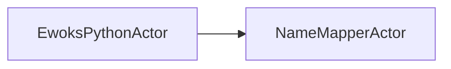
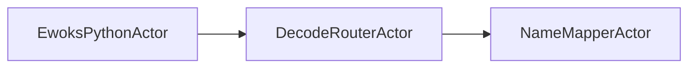
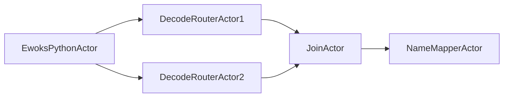
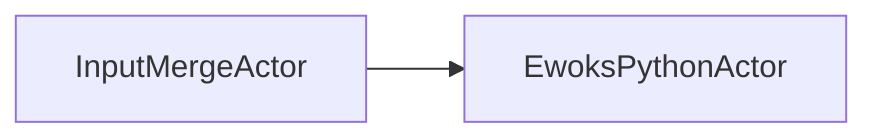

# EwoksPpf: Pypushflow binding for Ewoks

This task scheduler allows the execution of cyclic and acyclic graphs and uses python's *multiprocessing* for task distribution.

## Graph of actors
An Ewoks task graph is converted to a graph of *actors* before execution.

### Source
A task is wrapped by an *EwoksPythonActor* followed by some binder actors, depending on the type of link between source and target. For each link in the task graph, the final actor of the source is a *NameMapperActor* which is connected to the target.

#### Unconditional link

#### Conditional link with one condition

#### Conditional link with multiple conditions

#### On-Error conditional link

### Target

The *NameMapperActor* of a source for a specific target is connected to the *InputMergeActor* before that target.

### Start actor
The *StartActor* is connected to all tasks that are the start of a task scheduling thread.

### Stop actor
Tasks without successors are connected to the *StopActor*. This actor manages a dictionary of outputs which is considered to be the "output of the graph".

### Error handler
All actors that do not have an _on_error_ conditional link are connected to the *ErrorHandler* which directly connected to the *StopActor*.

### Custom actors
These actors are not provided by *pypushflow*

* *EwoksythonActor*: like *PythonActor* but it passes node name and attributes to the next actor.
* *InputMergeActor*: like *Joinactor* (merges the input data dictionaries) triggers the downstream actors when all required input has been provided at least once. Only one non-required input passed.
* *DecodeRouterActor*: line *RouterActor* but it dereferences thet input hashes to get the values.
* *NameMapperActor*: before triggering the next task it applies filtering and name mapping to the input data.
